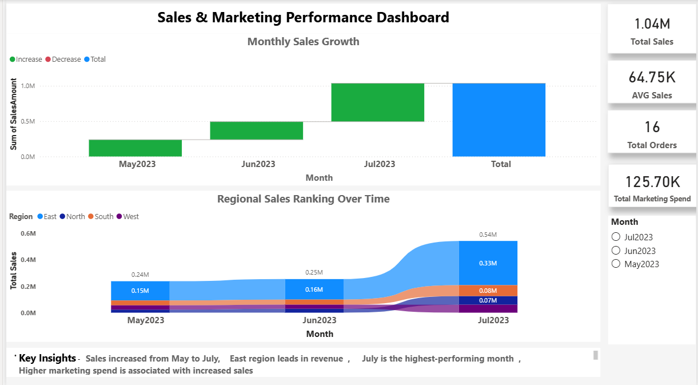

# 📊 Sales & Marketing Performance Dashboard (Power BI)

## 📌 Project Overview
As part of my Power BI learning journey, I developed an interactive Power BI report (dashboard-style) to analyse sales performance and marketing effectiveness using a structured sample dataset.

This dashboard transforms raw data into meaningful insights, focusing on KPIs, sales trends, regional performance, and the relationship between marketing spend and revenue.

---

## 🏢 Business Scenario
A sales manager needs a dashboard to monitor business performance across regions and understand how marketing investment impacts sales.

Key questions:
- What are total sales and average order value?
- How are sales trending over time?
- Which regions perform best?
- Does marketing spend influence sales?
- How do regional rankings change over time?

---

## 🎯 Objectives
- Track KPIs: Total Sales, Average Sales, Orders, Marketing Spend  
- Analyse monthly sales trends  
- Identify top-performing regions  
- Evaluate the impact of marketing spend on sales  
- Build an interactive dashboard for analysis  

---

## 📊 Dashboard Features

### 🔹 KPI Metrics
- Total Revenue  
- Average Order Value  
- Total Orders  
- Marketing Spend  

### 🔹 Visualisations
- Waterfall Chart – Monthly Sales Growth  
- Ribbon Chart – Regional Sales Ranking Over Time  
- Slicer – Month filter for interactive analysis  

---

## 📈 Key Insights
- Sales increased steadily from May to July  
- East region consistently leads in revenue  
- Higher marketing spend is associated with increased sales  
- July is the highest-performing month  

---

## 🧠 Business Insight (Marketing Impact)
Marketing spend represents the money invested by the company to promote products and attract customers.

In this analysis, an increase in marketing spend is associated with higher sales. As marketing investment rises, sales performance also improves, indicating a positive relationship between marketing efforts and revenue generation.

---

## 🛠️ Tools & Skills Used
- Power BI  
- DAX  
- Data Modelling  
- Data Visualisation  
- Business Analysis  

---

## 🎨 Design Approach
- Clean layout with light grey background and white visuals  
- Consistent colour scheme for clarity  
- Interactive slicer for filtering  
- Simple insights for quick understanding  

---

## 📂 Dataset
Sample dataset including:
- Sales transactions  
- Order dates  
- Regions  
- Marketing spend  
- Sales teams  

---

## 🚀 What I Learned
- Creating KPI measures using DAX  
- Building interactive Report (dashboard style layout)
- Choosing appropriate visualisations  
- Applying clean design principles  
- Understanding the relationship between marketing spend and sales  

---

## 📷 Dashboard Preview

## 📌 Conclusion
This project demonstrates my ability to analyse data, build interactive dashboards, and communicate business insights effectively using Power BI.
